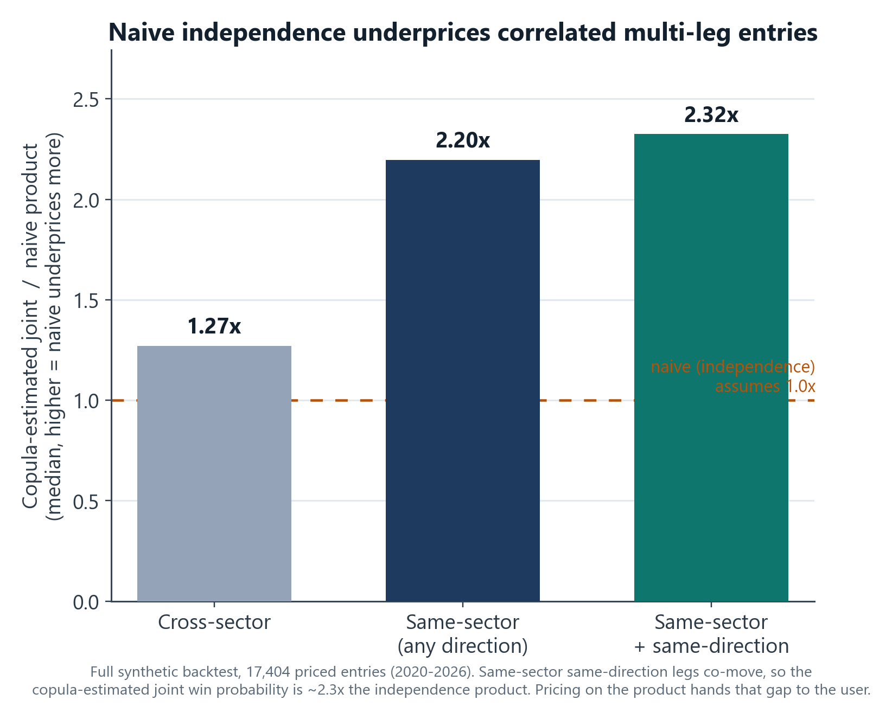
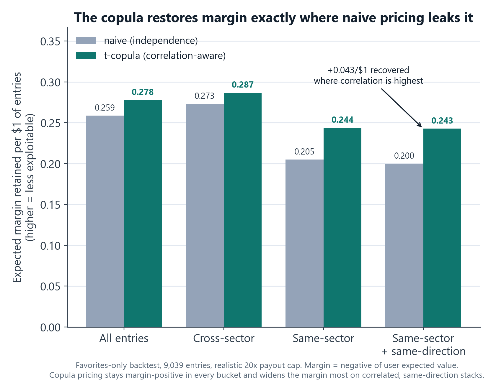

# Naive independence is an arbitrage: pricing correlated multi-leg predictions with a t-copula

*Portfolio case study for coopernorman.dev. Public-safe: all figures are backtest/validation on synthetic combinations priced against historical correlations; no realized P&L, no secrets.*

---

## TL;DR
On ShareShark, users could combine several stock predictions into one multi-leg entry that only pays if *all* legs win. The obvious way to price that is to multiply the per-leg probabilities together. That is also a bug you can lose real money to: stocks are correlated, so picking three tech names all "higher" is really one prediction on tech, not three independent ones, and the joint probability of all of them winning is far higher than the product. Multiplying anyway overpays the user on exactly the entries a sharp player would build. I priced these with a **Student-t copula Monte Carlo** engine that estimates the *joint* probability under a regime-aware, shrinkage-stabilized correlation matrix. In a six-year backtest it stays margin-positive in every strategy bucket, and it widens the margin most precisely where naive pricing leaks it: on correlated, same-direction stacks.

---

## The problem: why multiplying probabilities is wrong
The single-leg model ([QuantShark](quantshark.html)) gives a calibrated probability that one stock finishes on the predicted side. For a multi-leg entry, you need the probability that *every* leg wins at once. The naive answer multiplies them:

> P(all win) = p1 x p2 x ... x pN

That is only correct if the legs are independent. They are not. If a user picks AAPL, MSFT, and NVDA all "higher," those three move together: one good day for tech lifts all of them. So the real probability of all three winning is **much higher** than the product of the three. Price off the product and you quote odds that are too generous, and a player who simply stacks correlated same-direction legs earns positive expected value against the platform. The whole job of this engine is to compute the correlation-aware joint probability so that gap never opens.

How big is the gap? On the full backtest, the copula's estimated joint probability of a same-sector, same-direction combination is a **median of ~2.3x** the naive independence product. (On the realistic favorites-only set the effect is much smaller, a median near 1.0x, because high-probability legs leave less room for correlation to move the joint; the gap is largest on lower-probability combinations, which is where independence pricing is most exposed.) Independence pricing would hand that factor to the user.

## The approach: a t-copula Monte Carlo
A copula is the standard quant-finance tool for this: it lets you keep each leg's own probability exactly as the model gave it, while injecting a correlation structure between them. The engine prices each entry like this:

1. **Build a direction-adjusted correlation sub-matrix** for the legs. Two "higher" predictions on correlated stocks get positive correlation; a "higher" and a "lower" on the same correlated pair get *negative* effective correlation (one wins when the other tends to lose). This is a sign flip on the off-diagonals, and after it the matrix can lose positive-definiteness, so a small eigenvalue-clip repair runs before the Cholesky.
2. **Simulate correlated outcomes with heavy tails.** Draw correlated normals via the Cholesky factor, then scale them by a chi-square mixing term to turn them into **Student-t** samples (degrees of freedom = 5). The t, rather than a Gaussian copula, is deliberate: heavier tails mean more joint-tail dependence, so the engine assumes legs are *more* likely to crash together than a normal would, which is the conservative choice for the platform.
3. **Threshold into win/lose** by pushing the t-samples through the t-CDF to uniforms and comparing against each leg's probability, then count the fraction of simulations where all legs win. That fraction is the joint probability.
4. **Price conservatively against Monte Carlo noise.** Instead of using the raw simulated estimate, the engine uses the estimate plus 1.96 standard errors, a one-sided 97.5% upper bound on the joint probability. Sampling noise can therefore only ever make the quote *less* generous, never accidentally underprice it. Simulation counts scale with leg count (100k for 2 legs up to 2M for 5-6) so the estimate stays stable even as joint probabilities shrink.

## The hard part: estimating the correlation matrix
A copula is only as good as the correlation matrix behind it, and a raw sample correlation over a few hundred stocks is noisy and unstable. The matrix build is where most of the real work is:

- **Ledoit-Wolf shrinkage** pulls the noisy sample covariance toward a structured target, which is the standard fix for estimating a big covariance from limited data.
- **Blended lookback windows.** Three rolling windows (about 3 months, 6 months, and 1 year) are weighted 0.50 / 0.30 / 0.20, so the estimate is responsive to recent regime shifts without being whipsawed by them.
- **Sector correlation floors, as an explicit anti-exploitation control.** Same-sector pairs are floored at 0.40, structurally related sectors at 0.30, everything else at 0.05. The point is to *never assume independence* between two names that obviously co-move, even if a particular sample window happened to show low correlation. This is the single most important guard against a player gaming the pricer.
- **Volatility-regime uplift.** Correlations spike in a crisis (everything sells off together). When 30-day volatility is above its 90th percentile, off-diagonal correlations are inflated by up to 15%, scaled by how stressed the regime is, using only data available at the time.
- **Nearest-positive-definite repair.** Applying floors and uplift can break the matrix's positive-definiteness, which would make the copula unsamplable, so a Higham projection snaps it back to the nearest valid correlation matrix.

The production matrix covers **334 stocks**, and the backtest replays **73 monthly snapshots from 2020 through 2026**, each rebuilt using only data available as of that month.

## Does it work?
The validation is honest about what it is: synthetic multi-leg entries built from the real model's per-leg probabilities on the held-out test set, priced against the historical correlation matrices, then scored on the realized outcomes. No live money is involved. The realistic test models actual user behavior: only favorites (per-leg probability above 0.30), with legs added until the payout would breach the 20x cap.

- **Better calibrated than naive.** Across 9,039 favorites-only entries, copula log-loss is **0.486 vs 0.488** naive, and expected calibration error is **0.014 vs 0.022**. Modest, because on favorites the correlation effect is smaller, but it moves the right direction on both proper-scoring and calibration.
- **Margin-positive everywhere, and tightest where it matters.** Margin here is the negative of the user's expected value per $1 of entry, so positive margin means the price is not exploitable. Across every bucket I sliced (by sector mix and by leg count, 2 through 5 legs) the copula keeps that margin positive. Crucially, on the same-sector same-direction "exploit" entries (n=1,763), it recovers an extra **0.043 per $1** versus naive pricing, exactly the place where independence pricing thins toward exploitable.

The honest nuance: the copula is conservative *everywhere* by design (the CI upper bound, the cross-sector floor, and the regime uplift all nudge it the same way), so it tightens cross-sector entries a little too. But it tightens correlated, same-direction entries the most, which is the entire goal.

## Engineering
- **Vectorized Monte Carlo.** The whole M-by-N simulation is numpy matmul and broadcasting with `int8` outcome arrays, so even the 2-million-sim case prices in well under a second.
- **Degeneracy guards.** A CALL and a PUT on the same stock is logically impossible to win together, so it short-circuits to zero probability; same-stock same-direction legs are forced to correlation 1.0; probabilities are validated into (0,1); and there is a two-stage positive-definite fallback.
- **Ten analytical unit tests** pin the behavior to ground truth: uncorrelated legs reproduce the product, perfectly correlated legs reduce to the minimum leg probability, correlated same-direction beats naive, opposite-direction comes in below naive, plus speed bounds.
- **Look-ahead-safe backtest.** Each entry is priced with the *prior* month's correlation matrix, never one built with data from after the entry date.
- **Production staleness guard.** The serving path caches the matrix in memory and refuses to price multi-leg entries at all if the matrix is more than a day stale, so a failed refresh disables the feature rather than pricing on stale correlations.

## What this demonstrates
- **Quantitative-finance depth applied correctly:** copulas, Cholesky sampling, Ledoit-Wolf shrinkage, Higham nearest-PD repair, regime-conditional correlation, and conservative confidence-interval pricing, all in service of one concrete pricing problem.
- **Adversarial / anti-exploitation thinking:** the design question throughout is "how would a sharp user beat this price," and the sector floors, heavy tails, and CI upper bound are direct answers.
- **Validation discipline:** out-of-sample, look-ahead-safe, scored per strategy bucket, with the conclusion stated in the metric that matters (margin retained) rather than a flattering aggregate.

## Tech stack
Python · NumPy (vectorized t-copula Monte Carlo, Cholesky) · SciPy (Student-t CDF) · scikit-learn (Ledoit-Wolf shrinkage) · pandas (rolling-window correlation, point-in-time backtest) · custom Higham nearest-PD repair.

## Honest notes
All results are backtest/validation: synthetic multi-leg combinations built from the single-leg model's probabilities and scored against realized outcomes, not realized trading P&L. The per-bucket margins are simulation point estimates with no transaction-cost or friction modeling, so treat them as directional evidence that the pricing holds up, not as guaranteed live numbers. The correlation impact is largest on low-probability longshots and smaller on favorites, so the calibration and margin figures use the realistic favorites-only set while the correlation-impact figure uses the full synthetic universe; the two are kept separate and labeled. A flex / partial-payout extension (paying out on k-of-N legs) is designed but not built; the existing simulation already produces the full win-count distribution it would need. The single-leg probabilities it prices on come from the [QuantShark](quantshark.html) model.
