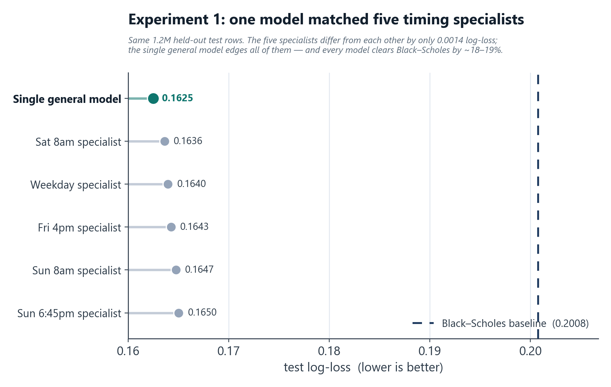
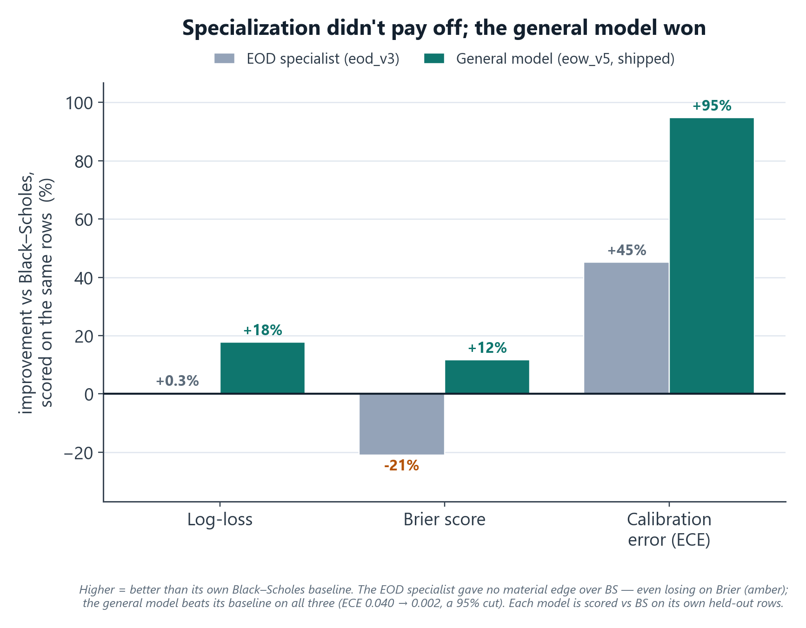
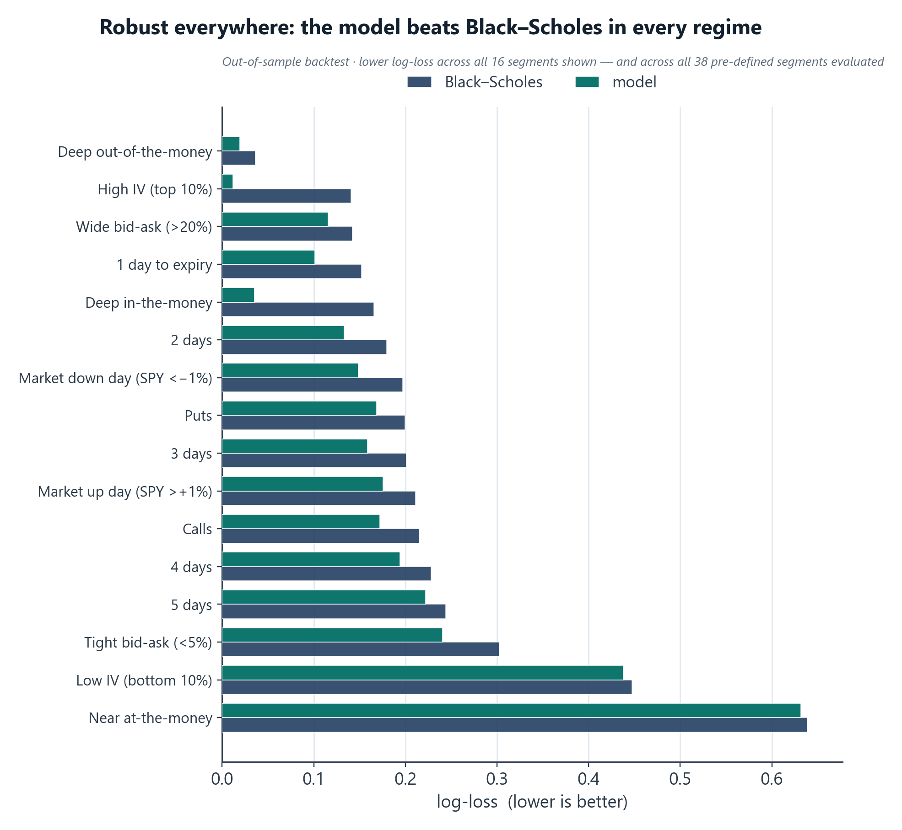

# One model, not seven: letting backtests kill my own hypotheses

*Portfolio case study for coopernorman.dev. Public-safe: all performance figures are backtest/validation; no realized P&L; no secrets.*

---

## TL;DR
While building ShareShark's options-pricing engine I twice hypothesized that **more specialized models** would price better: first a separate model per market-timing window, then a dedicated end-of-day model trained on synthetic data. Both times I built the specialized version, backtested it honestly against a fair baseline, and the data said the same thing: **one robust model covering the whole short-dated range wins, on accuracy *and* on production simplicity.** I shipped the single model and deleted the rest.

---

## Why it was tempting
On a prediction platform the price *is* a probability, so pricing quality is everything, and two "more clever = better" instincts looked obviously right:

1. **Timing windows.** Weekend and after-hours prices lean on Bitcoin snapshots captured at specific times (Fri 4pm, Sat 8am, Sun 8am, Sun 6:45pm) versus a normal weekday 4pm close. Each window carries different information → so train a model per window.
2. **Horizon specialization.** An option expiring *today* (1 day to expiry) behaves differently from one expiring in a week → so a dedicated end-of-day (EOD) specialist should beat a generalist on EOD contracts.

Both are reasonable. Both are exactly the kind of complexity you add by *assuming* instead of *measuring*. So I measured.

## Experiment 1: five timing-window models
I trained five separate LightGBM models (one per snapshot window), each with its own feature set, its own data pipeline, and snapshot-specific "time since last close" features, routed in production by the active snapshot. Then I backtested them **apples-to-apples on the same held-out test set (1.2M rows):**

| Model | Test log-loss | vs. Black-Scholes |
|---|---|---|
| **Single general model** | **0.1625** | **−19.1%** (best) |
| Sat 8am | 0.1636 | −18.5% |
| Normal weekday | 0.1640 | −18.3% |
| Friday 4pm | 0.1643 | −18.2% |
| Sun 8am | 0.1647 | −17.9% |
| Sun 6:45pm | 0.1650 | −17.8% |

The five "specialists" differed from each other by only **0.0014 log-loss**, and the single general model beat every one of them (also best on AUC 0.980 and calibration error 0.0025). An ablation put the Bitcoin-timing signal at **0.24% of log-loss, roughly 1% of the total edge over Black-Scholes.**

**Verdict:** the timing window barely mattered, and it's worth saying why. That overnight/weekend signal ideally wants live index-futures data, but a commercial futures feed was far too expensive for a startup to justify, so the models leaned on Bitcoin snapshots, the one liquid market that trades 24/7, as a free proxy for broad risk sentiment while equities were closed. For a ~1% slice of the edge, five models meant five data pipelines and five points of failure, for nothing. I collapsed them into one and kept a single lightweight Bitcoin freshness feed for weekend pricing; that was worth it, the five were not.

## Experiment 2: the EOD specialist (a clever augmentation that still lost)
End-of-day contracts (expiring today) really are a different regime, so I built an EOD-specific model. The clever part: real DTE-1 training data is scarce, so I **manufactured it.** I took real DTE 2–5 options, re-labeled them against the *next* trading day's close (handling weekends/holidays via an exchange calendar), and **regenerated every Greek at T = 1 day** (recomputing delta/gamma/theta/vega/rho, the IV-derived features, and the moneyness buckets) to turn each into a synthetic "DTE-1" sample. That multiplied the DTE-1 training set several-fold (3.4M rows). I tried two architectures: direct prediction, and a Black-Scholes-**residual** model (LightGBM learning corrections on top of the BS price).

The honest result: **every EOD variant lost to plain Black-Scholes on the real test set.**

| Model | Test log-loss | vs. Black-Scholes |
|---|---|---|
| **Black-Scholes baseline** | **0.1456** | — |
| EOD (direct, best) | 0.1471 | +0.0015 (worse) |
| EOD (BS-residual, lean) | 0.1524 | +0.0068 (worse) |
| EOD (BS-residual, full) | 0.2064 | blew up |

DTE-1 is the *one* regime where Black-Scholes is already strongest, so a learned model had almost no room to add value, and the heavy residual variant destabilized completely. The augmentation was genuinely clever; the conclusion was still **"don't ship this."**

> The trap I had to avoid: on its *own* synthetic DTE-1 dataset the EOD model posted a gorgeous-looking log-loss, but that's an easier task scored on different data. The *fair* comparison is EOD vs. Black-Scholes on the real test set, where it lost. Knowing which comparison is honest is the whole game.

## What won: one robust short-DTE model
A single model covering the full short-dated range (DTE 1–5/1–7) on **real** expiry labels: what shipped as the production EOW model. It won on every axis:

- **Accuracy & calibration (backtest):** AUC **0.979**, log-loss **0.171**, expected-calibration-error **0.0021**, versus a Black-Scholes baseline at AUC 0.973, log-loss 0.207, ECE 0.040. The single model's calibration was an order of magnitude better than Black-Scholes.
- **Production simplicity:** one model, one data pipeline, no snapshot-routing logic, no synthetic-data step. Easier to serve in real time, far fewer failure modes, one thing to monitor.

On top of it sits a separate correlation-aware **multi-leg pricer** (a t-copula Monte-Carlo overlay for correlated multi-leg entries), but the *pricing brain* is the one model. (This is the same model family whose weekend train/serve-skew bug I later caught and fixed; see the [QuantShark case study](quantshark.html).)

## What this demonstrates
- **Calibrated experimentation over intuition.** I had a plausible thesis twice, built it, measured it on held-out data, and let the result overrule me, instead of shipping complexity because it felt smart.
- **Simplicity as a feature, not a compromise.** The winning architecture was also the simplest to operate. That alignment is worth protecting.
- **Knowing which comparison is fair.** The flattering synthetic-data number would have justified the wrong decision; the honest baseline comparison killed it.

## Validation methodology
Temporal split (train on earlier data, test on a later held-out period); the *same* held-out test set across compared models; log-loss, AUC, and calibration error (ECE) all reported; Black-Scholes as the baseline everything is measured against. Where a comparison wasn't apples-to-apples (synthetic DTE-1 vs. real), I flag it rather than quote the flattering figure.

## Tech stack
Python · LightGBM · scikit-optimize (Bayesian search) · SciPy / NumPy (vectorized Black-Scholes & Greek regeneration) · pandas · temporal cross-validation.

## Honest notes
All figures are backtest/validation on historical data; ShareShark operated pre-launch / low-traffic, so these are model-quality results, not realized P&L. "Short-DTE" appears as DTE 1–5 in the comparison files and DTE 1–7 in the deployment plan. The synthetic-augmentation multiple is approximate. The multi-leg pricer is an overlay on the single model, not a second pricing model.
