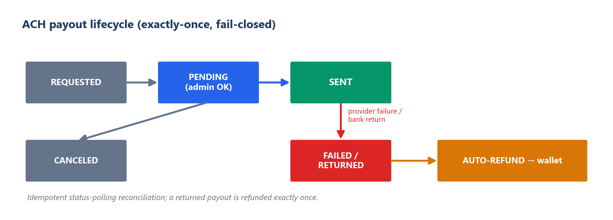

# Shipping a regulated-money stack, solo

*Portfolio case study for coopernorman.dev. Public-safe: no realized P&L, no secrets/PII; the diagram is conceptual.*

---

## TL;DR
The hard part of a real-money platform isn't the database: it's wiring together a dozen third-party rails (payments, identity, geolocation, fraud, tax) so that real cash only ever moves to the right person, and every rail fails *safely*. I built and operated the entire money-and-compliance stack of **ShareShark** (a real-money, dual-currency sweepstakes prediction platform) solo: an idempotent ACH payout lifecycle, KYC/AML gating, encrypted PII, year-end tax reporting, and multi-signal geofencing, including a fix for the false-positives that wrongly block legitimate users.

## The problem
On a money platform, the expensive failures live at the **seams**, where your code meets a payment processor, an identity vendor, a geolocation API, a webhook you didn't send. Real cash leaving to an unverified, geo-ineligible, or fraudulent user is the failure that actually costs you. So the design rule was simple: **every external rail fails closed**, and money only moves once every check has passed.

## The ACH payout lifecycle (idempotent, fail-closed)
Withdrawals move real cash through an ACH provider (Payliance) as a state machine (REQUESTED → PENDING → SENT, with FAILED / RETURNED branches) gated by manual approval, with **encrypted bank details** and **exactly-once auto-refund** when the provider fails or the bank returns a transfer. The provider doesn't push reliable webhooks, so the system **reconciles by idempotent status-polling**: it can run reconciliation twice and never double-credit or double-refund.

## The clever part: geofencing that doesn't punish real users
State-by-state eligibility means IP geolocation, but **strict IP gating has a brutal failure mode**. Cellular carriers route users through CGNAT pools that can resolve to a neighboring (sometimes ineligible) state, and VPN-detection false-fires on ordinary privacy browsers. Naive geofencing quietly blocks *legitimate* users on their phones.

So I built a tiered pipeline: a fast local MaxMind lookup first, a paid precision API only as a second opinion (to conserve credits), and an **authoritative browser-GPS override** that settles eligibility regardless of what the IP says, plus confidence-tiered VPN handling (hard-block relay/Tor, log-but-allow soft signals). Compliance stays strict; real users stop getting wrongly turned away. *Keeping the gate tight without locking out real customers is the part most people get wrong.*

## Identity, encryption, and tax
- **KYC (Veriff):** government-ID + selfie/liveness, triggered at identity, tax, and velocity thresholds (plus random audit), with **fail-closed, constant-time HMAC** webhook verification so a forged "approved" callback can't slip through.
- **Encryption at rest:** AES-256-GCM for SSNs and bank details; masked display everywhere.
- **Tax:** W-9 collection at the IRS reporting threshold, feeding a year-end 1099 pipeline.
- **Fraud / AML:** device fingerprinting for multi-account detection, plus velocity caps, risk holds, and suspicious-activity logging.

## Payments that are safe to retry
Settlement and refunds run on schedules, so they have to be safe to run more than once. Every money-moving step is **idempotent** (a completed payout or an issued refund can't be issued again), so a retry, an overlapping job, or a provider hiccup never double-pays.

## Validation & testing
Focused tests on the highest-risk money paths (payouts, refunds, redemption gating), and **separate staging and production** environments so changes were exercised before they could touch real funds.

## What this demonstrates
- **Regulated-money fluency:** ACH, KYC/AML, tax, encryption, geofencing and fraud, *integrated and shipped*, not theorized.
- **Integration discipline:** a dozen third-party rails wired so each one fails closed.
- **Product-minded compliance:** keeping the gate strict without blocking legitimate users (the geo-rescue is the proof).

## Tech stack
Python · Django · Django REST Framework · PostgreSQL · Celery / Redis · AES-256-GCM · Payliance (ACH) · Veriff (KYC) · MaxMind (geolocation) · deployed on AWS behind Nginx/Gunicorn.

## Honest notes
ShareShark ran a year of free-to-play and a small real-money soft launch (~50 users), so this is **design-and-integration** work validated in a live soft launch, not "battle-tested at N TPS." It stays live as free-to-play at [shareshark.app](https://shareshark.app). Third-party services (Payliance, Veriff, MaxMind, the fingerprinting vendor) do real work; the contribution is the integration design, the fail-closed and idempotent wiring, the geolocation-rescue insight, and the breadth of compliance shipped by one person.
