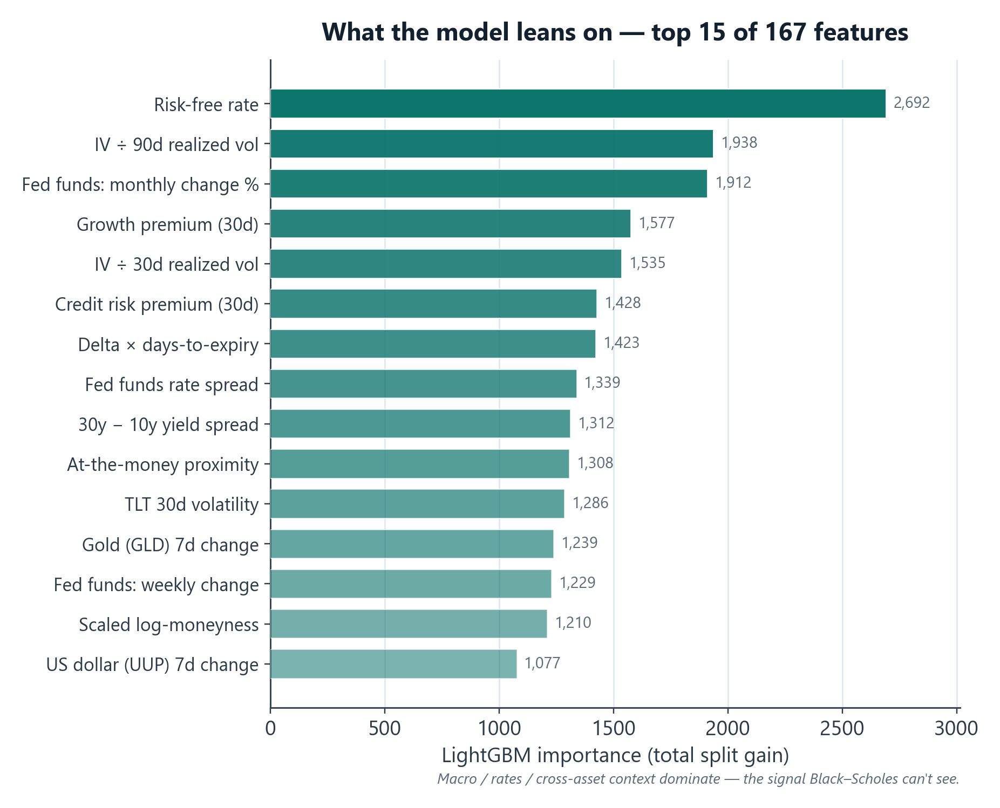
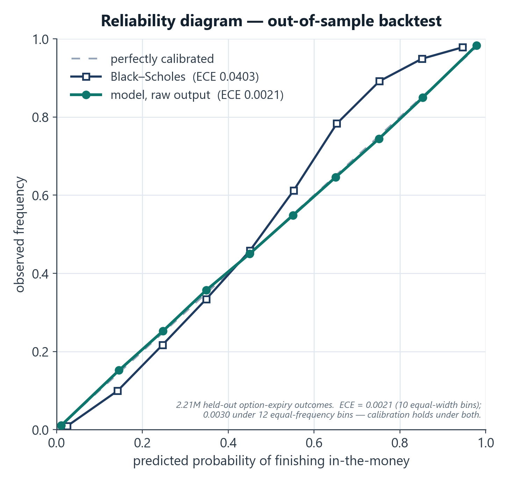
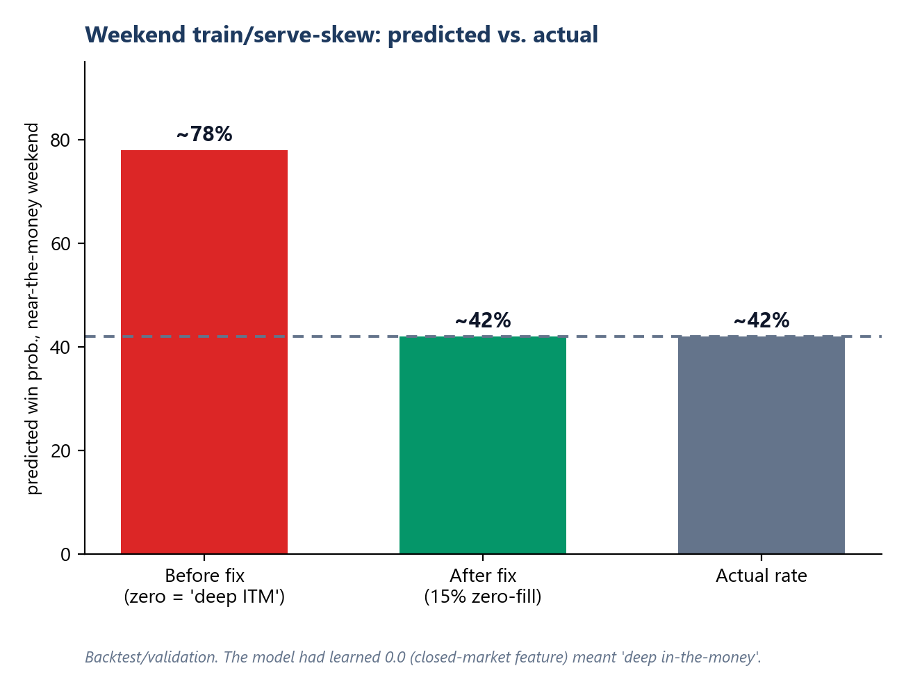
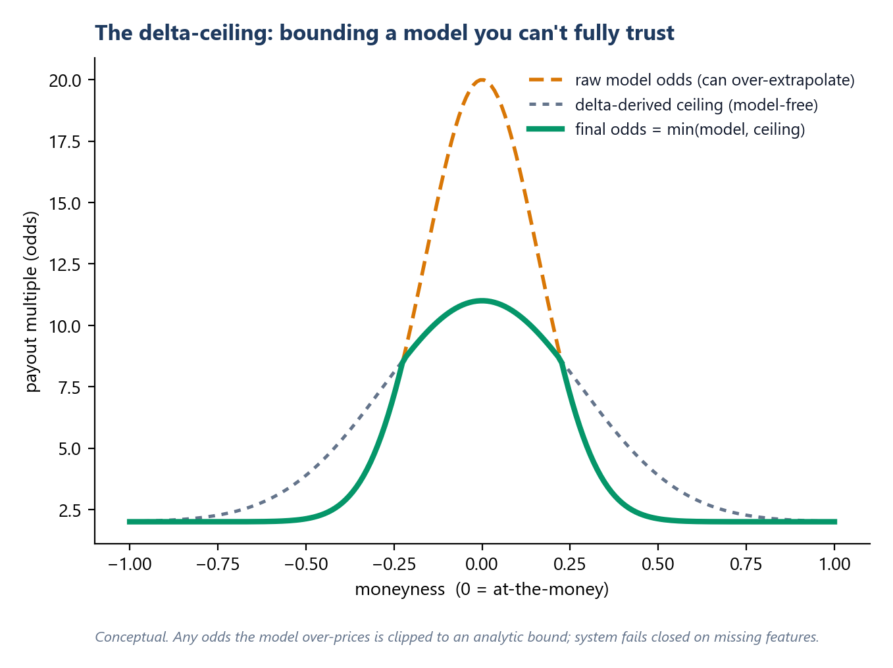

# Case Study, QuantShark: pricing short-dated options with a calibrated model + a safety net

*Portfolio case study for coopernorman.dev. Public-safe: all performance figures are backtest/validation; no realized P&L; no secrets.*

---

## TL;DR
I built the pricing brain of **ShareShark**, a real-money, dual-currency sweepstakes prediction platform, solo. It's a gradient-boosted model that estimates the probability a short-dated stock option finishes in-the-money, wrapped in calibration checks and a model-free safety layer so a confident-but-wrong prediction can never become an exploitable price. In backtest it beat a Black-Scholes baseline on **every** metric, and *dominated* the one that matters most for a pricing product, calibration: **expected-calibration-error 19× tighter (0.002 vs 0.040)**, worst-case calibration error 18× tighter, plus 18% lower log-loss and a better Brier score.

---

## The problem
On a prediction platform, **the price *is* the product**, and the price is just a probability: odds = 1 / P(in-the-money). That means a model that's *accurate on average* but *miscalibrated* is worse than useless: if it says 80% when the truth is 42%, every user who notices prints money off you.

So the goal wasn't "high accuracy." It was **trustworthy probabilities across the whole distribution**, plus guardrails for the cases where any model eventually misbehaves.

## The approach

**Data & features.** 21.5M training rows across 342 stocks, with **167 engineered features**: option Greeks, implied and realized volatility structure, moneyness buckets, ETF/macro context, a Black-Scholes baseline as a feature, and market-microstructure signals.

**Model.** Today it's a **single, unified LightGBM model** covering the full short-dated horizon, but it got there by iterating. For a long stretch it actually ran as *multiple* specialized models in production (one per market-timing window, plus separate end-of-day / end-of-week models); each version got better, and at some point I tested whether that specialization was still earning its keep. It wasn't, so I consolidated into one robust model that beat the specialized versions on accuracy *and* was far simpler to run. (Full story → [model-consolidation case study](model-consolidation.html).)

**Tuning that can't cheat.** I drove hyperparameters with a 14-dimensional Bayesian search (scikit-optimize) over the usual overfitting controls (L1/L2 regularization, minimum data per leaf, feature and row subsampling, min-split-gain, path smoothing) plus early stopping. But regularization alone won't stop a search from finding a *degenerate* model (one that always predicts near the base rate can post a deceptively low log-loss), so I hardened the objective with **9 guards** that auto-reject candidates that are overconfident, low-entropy, wrong-direction, collapsed onto a single probability, or showing a train/validation gap that screams overfitting. The optimizer literally can't select them.

**Selecting for generalization, not a lucky validation score.** The classic trap in hyperparameter search is overfitting the *validation* set: run enough configs and the "best" one is often just the luckiest on that split. So I didn't select on validation alone. Every candidate was **backtested on a separate, untouched test set**, with log-loss, Brier, AUC, and calibration (ECE/MCE) logged on *both* validation and test. The config I shipped was the one most **consistent across both** on accuracy *and* calibration, not the single lowest number the optimizer chased, and then I **refit it from scratch and re-ran the full backtest** to confirm the result held. Slower, but it's the difference between a model that looks good on your split and one that actually generalizes.

## Calibration is the product
I evaluated with **expected-calibration-error (ECE)** and reliability curves, not just AUC. Interesting result: the **raw** LightGBM output was already better-calibrated (ECE ≈ 0.0021, about 19× tighter than Black-Scholes) than fitted Platt/Isotonic post-processors, so I shipped raw and kept the calibrators as monitored fallbacks. The discipline: *measure calibration explicitly and let the data decide, rather than assuming you need a calibration layer.*

## The hardest bug: weekend train/serve skew
In testing I found the model pricing near-the-money weekend contracts at 76–83% when the true rate was 42%. Weekday accuracy was fine, so it wasn't model quality.

Root cause: 17 features depend on **live bid/ask**, which the data vendor returns as `0.0` when markets are closed. In training, `0.0` had only ever appeared as a *real* value (deep-in-the-money), so the model learned `0.0 → near-certain`. At serve time on weekends, `0.0` meant *"missing."* **Same value, opposite meaning.**

Fix: retrain with **15% zero-fill augmentation**, teaching the model that `0.0` can also mean "no signal: lean on delta/Greeks/Black-Scholes." Ablation confirmed near-the-money weekend predictions fell from 74% to a correct 42%, with no loss of weekday accuracy. Shipped as a drop-in weight swap.

## The safety net: a model-free "delta ceiling"
Even a 0.979-AUC model occasionally extrapolates badly in the deep-out-of-the-money tail, and any over-generous price is a direct loss. So model output is never trusted unconditionally: I bound it with an **analytic ceiling derived from the option's delta** (`1/|delta|`), cap the model's odds at a fixed multiple of that bound, blend a symmetric floor to correct known near-the-money over-juicing, and **log every override**. The model adds value where it's confident; the math constrains it where it isn't; the system **fails closed** on missing features.

## Bonus: pricing correlated multi-leg entries
Users could combine multiple predictions, which are **not independent** (two tech megacaps move together). Naive independence would systematically misprice them and hand out arbitrage. So multi-leg prices come from a **t-Copula Monte Carlo** simulation (Student-t for fat tails) over a correlation matrix stabilized with **Ledoit-Wolf shrinkage**, sector correlation floors, a volatility-regime uplift, and a nearest-positive-definite repair, priced conservatively on the **97.5%-CI upper bound** of joint probability.

## Validation methodology
Every figure here is **out-of-sample**. The model was evaluated on a **temporal split** (train on earlier periods, validate on later, held-out periods) to prevent look-ahead leakage. I report **calibration (ECE/MCE)**, **proper scores (log-loss, Brier)**, and **ranking (AUC)** on the held-out period, and confirmed the weekend-skew fix by **ablation** (toggling the zero-fill augmentation), not just by watching an aggregate number move.

## Results (out-of-sample backtest)

| Metric | QuantShark (LightGBM) | Black-Scholes | Margin |
|---|---|---|---|
| ROC AUC ↑ | **0.979** | 0.973 | edges an already-strong baseline |
| Log-loss ↓ | **0.171** | 0.207 | **18% lower** |
| Brier score ↓ | **0.053** | 0.060 | **12% lower** |
| Expected calibration error (ECE) ↓ | **0.0021** | 0.0403 | **19× tighter** |
| Max calibration error (MCE) ↓ | **0.0079** | 0.1392 | **18× tighter** |

*↑ higher is better, ↓ lower is better. Out-of-sample backtest of the production model; these are validation figures, not realized profit.*

Ranking (AUC) was already near the ceiling for both, so the real story is **calibration**: the model's stated probabilities track reality far more tightly than Black-Scholes, which is exactly what keeps a pricing product from being picked off.

## What this demonstrates
- **Quant + ML judgment:** calibration-first evaluation, regime-segmented models, derivative-pricing literacy (Greeks, copulas, shrinkage).
- **Production ML engineering:** train/serve parity, fail-closed inference, diagnosing skew, shipping safe weight swaps.
- **Risk thinking:** treating a model as something to *bound*, not blindly trust.

## Tech stack
Python · LightGBM · scikit-optimize · SciPy / NumPy (t-copula, Ledoit-Wolf, nearest-PD) · pandas · Django/Celery for serving.

## Honest notes
Metrics are backtest/validation on historical data; ShareShark ran a year of free-to-play and a small real-money soft launch (~50 users), not a full public launch, so these are model-quality backtest results, not live trading P&L. The heavy numerical lifting uses standard libraries (LightGBM, SciPy); the contribution is the feature engineering, the anti-degeneracy guards, the skew diagnosis, the calibration discipline, and the safety layers.
