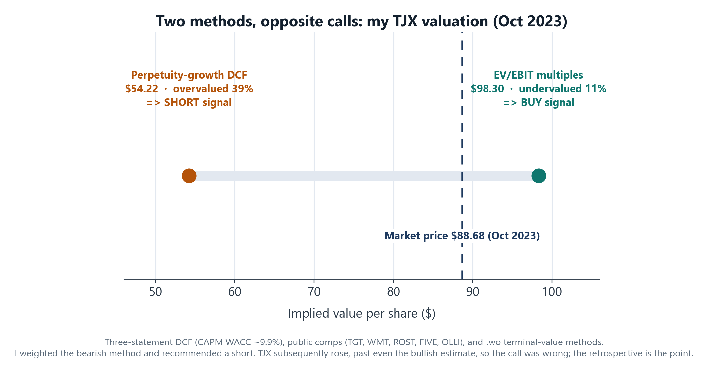

# Valuing TJX two ways: a DCF, a split signal, and a retrospective on a wrong call

*Portfolio case study for coopernorman.dev. An equity-valuation writeup from October 2023. Public-safe: my own analysis on public companies; no non-public information.*

---

## TL;DR
I built a full three-statement discounted-cash-flow model on **TJX Companies** (the off-price retailer behind T.J. Maxx, HomeGoods, and Marshalls) and valued it under two terminal-value assumptions that disagreed sharply: a perpetuity-growth DCF implied the stock was **overvalued by ~39%** ($54 vs a ~$89 price), while an exit-multiple (EV/EBIT) DCF, cross-checked against comparables, implied it was **undervalued by ~11%** ($98). I over-relied on the perpetuity-growth output and recommended a short. **The market proved me wrong** and TJX rose. I'm featuring this as a post-mortem: my own multiples method *and* the market both rejected my perpetuity DCF, and the lesson is reading that disagreement correctly instead of trusting the outlier.

---

## The company and the call
TJX in October 2023: ~$89 per share, ~$104B market cap, the largest off-price apparel and home-goods retailer in the US. Consensus was bullish. One of my two terminal-value methods disagreed, and my written recommendation was **short**, framed as a low-conviction, exploratory idea rather than a high-conviction call.

## The model (the mechanics matter)
A standard but fully-built **three-statement model**, not a single tab of guesses:
- A linked **income statement, balance sheet, and cash-flow statement** feeding an unlevered free-cash-flow buildup (Revenue to EBIT to NOPAT, plus D&A, less the change in net working capital, less CapEx).
- A separate **net-working-capital schedule** projecting receivables, inventory, and payables as historical percentages of sales.
- A **CAPM cost of equity** rolled into a market-value-weighted **WACC of ~9.9%** (blended ~9.6%), with a ~20% effective tax rate.
- **Two terminal-value methods** so the valuation didn't hinge on one assumption: a perpetuity-growth terminal value and an exit-multiple terminal value.
- A **public-comparables sheet** (Target, Walmart, Ross Stores, Five Below, Ollie's Bargain Outlet) across EV/EBITDA, EV/EBIT, P/E, and EV/Sales.
- Two-way **data-table sensitivities** (WACC against terminal growth, and WACC against terminal multiple) so I could see the valuation surface, not just a point estimate.

## The split signal
After tuning the model, the two terminal-value methods landed on opposite conclusions:

- **Perpetuity-growth DCF: $54.22** implied, overvalued ~39% versus the $88.68 price. A short signal.
- **Exit-multiple DCF (EV/EBIT, set against the comparables): $98.30** implied, undervalued ~11%. A buy signal.

A wide spread between two terminal-value assumptions is itself information. I documented it openly in the writeup rather than quietly dropping the one I didn't like, and reasoned that "people are overestimating TJX's growth" was the thread connecting both.

## The judgment, and the adjustments I made to it
I made three deliberate adjustments, and I want to be candid about each because two of them helped TJX and one of them is a real weak point:
- **Stripped 2021 from the historical averages** (sales growth, EBIT margin, tax rate). COVID distorted that year, so excluding it is defensible, and it actually *raised* the implied price.
- **Switched the terminal multiple from EV/EBITDA to EV/EBIT.** EBIT fit TJX's economics better and tightened the gap to the comps' median multiple. Also pushed the value *up*.
- **Raised revenue growth from 6.4% to 8.2%**, based on a figure from a Yahoo Finance article. This is the soft spot: the 8.2% was a *cash-flow* growth number I applied to *revenue*, which is not a clean substitution. I flagged it in the writeup at the time, but a sharper version of me would not have leaned on a loosely-sourced input for the single most sensitive assumption in the model.

Even after these upward adjustments, the perpetuity method *still* implied overvaluation, and that is the output I over-weighted into the short.

## What actually happened, and what I'd do differently
TJX went **up**, past even my bullish $98 estimate. The short was wrong, and the method I underweighted (multiples) plus the market were right. Owning that is the whole reason this case study exists. What I take from it:
- **Weight methods by reliability, not by which confirms your thesis.** When my own multiples method *and* the broad market both disagreed with my perpetuity DCF, that was a signal to distrust the outlier, not to follow it.
- **A terminal-growth DCF is hypersensitive to the growth input**, and mine came from a loose source. The sensitivity table even showed how much the call swung on that one cell. The right move is to anchor the most-sensitive input the most rigorously, not the least.
- **Respect the base rate.** High-quality compounders with durable models (which TJX is) tend to keep compounding; shorting that needs a sharper catalyst than "the multiple looks full."

## The other side of the ledger
TJX was a miss, but it's one of several company DCFs I built, and the process produces hits too. A model I ran on **PulteGroup** (the homebuilder) around the same period implied meaningful upside against the price in the model, a long call that the stock went on to vindicate as homebuilders rallied. I'm featuring the TJX *miss* rather than the PulteGroup *hit* on purpose: the wrong call is where the useful lessons live, and an analyst who can tell you exactly why they were wrong is more trustworthy than one who only shows the wins.

## What I learned
- **Real valuation mechanics:** a linked three-statement model, CAPM/WACC, dual terminal-value methods, a comps set, and two-way sensitivity analysis, built from the financials up.
- **Intellectual honesty:** I documented the split, named my own weakest assumption, made the call, and then owned being wrong with specific lessons. That retrospective habit is the difference between an analyst who got lucky and one who improves.
- **Judgment under disagreement:** when two terminal-value methods point opposite ways, the move is to distrust the outlier, not to follow it. I learned that the hard way here.

## Tools
Excel (three-statement model, CAPM/WACC, comparable-company analysis, two-way data-table sensitivities) and a written investment thesis.

## Honest notes
This is an October 2023 analysis on a public company, done as independent valuation work; it is a student-to-early-analyst-grade model, not an institutional research product. The numbers above ($54.22 perpetuity, $98.30 EV/EBIT, $88.68 price) are from my own model and writeup at the time. The recommendation (short) was directionally wrong; I'm presenting it for the process and the retrospective, not as a winning call.
